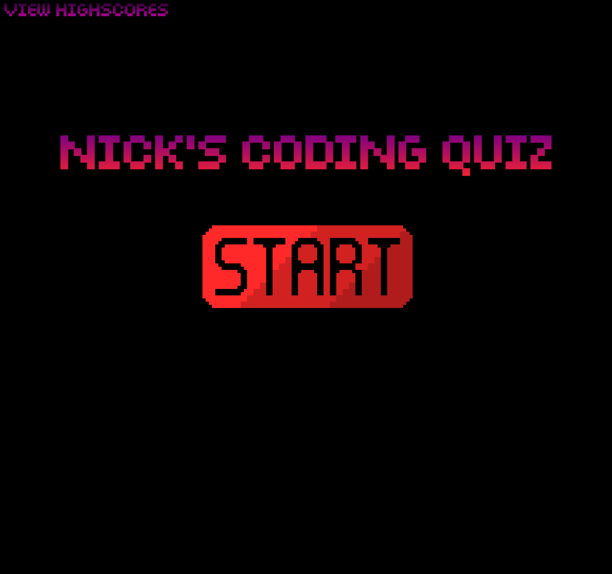

# Nick's Coding Quiz

This is a web-based quiz application that tests your knowledge of JavaScript, CSS, and HTML. The quiz presents a series of multiple-choice questions and keeps track of your score and time remaining. At the end of the quiz, you can save your score and view the high scores.

(https://nickucla.github.io/Nicks-Bootcamp-Quiz/)

## Usage

To use the application, simply open the `index.html` file in a web browser. The quiz interface will be displayed, showing the title "Nick's Coding Quiz" and a "Start Game" button. Clicking the "Start Game" button will begin the quiz.

During the quiz, you will be presented with a question and a list of choices. Click on the choice that you think is the correct answer. If you choose the correct answer, the result will be displayed as "Correct!" and you will proceed to the next question. If you choose the incorrect answer, the result will be displayed as "Incorrect!" and a penalty of 5 points will be applied to your score.

You have a time limit of 120 seconds (2 minutes) to complete the quiz. The remaining time is displayed at the top of the quiz interface. If the time runs out before you finish the quiz, the quiz will end and your final score will be displayed.

After completing the quiz or when the time runs out, you will be prompted to enter your initials to save your score. Enter your initials in the provided input field and click the "Save" button. Your score will be saved along with your initials.

You can view the high scores by clicking on the "View Highscores" link in the header. The high scores will be displayed in descending order, showing the names and scores of the top 10 players.

## Technologies Used

This quiz application is built using HTML, CSS, and JavaScript. It utilizes the following features and techniques:

- HTML structure and elements for creating the quiz interface and high score display.
- CSS styles for visual presentation and layout.
- JavaScript for dynamic behavior and interactivity of the quiz.
- DOM manipulation to dynamically generate questions and choices, handle user input, calculate scores, and save high scores to local storage.
- Event listeners to capture user actions such as clicking on choices and buttons.
- Timers to track the remaining time for the quiz.
- Local storage to store and retrieve high scores.

## Customization

You can customize the quiz by modifying the questions, choices, and answers in the JavaScript code. The questions are defined as an array of objects, where each object represents a single question with its choices and correct answer. Feel free to add, remove, or modify the questions to suit your needs.

You can also customize the appearance of the quiz by modifying the CSS styles in the `style.css` file. Adjust the colors, fonts, sizes, and layout properties to match your desired design.

## Credits

The quiz application was developed by Nick Heal and is based on criteria provided by UCLA Extension.

## License

This project is licensed under the [MIT License](https://opensource.org/licenses/MIT).
